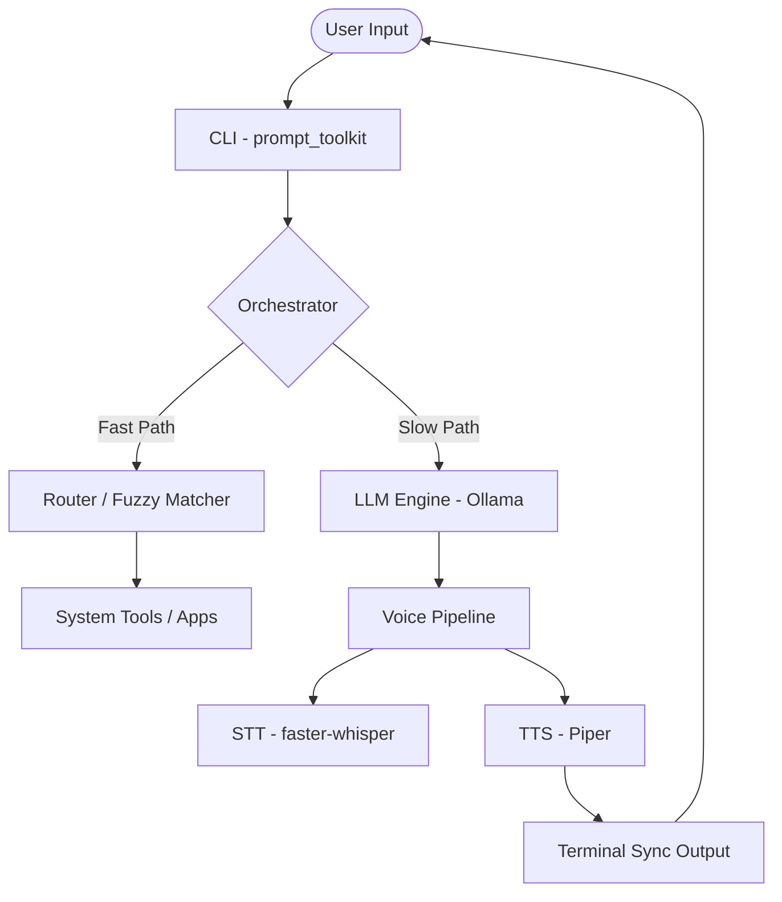

# 🤖 ARIA — Advanced Real-time Intelligent Assistant

[](https://www.python.org/downloads/)
[](https://ollama.com/)
[](https://www.microsoft.com/windows)

ARIA is a fully **local, privacy-first AI assistant** designed for ultra-low latency interaction. Unlike cloud-based assistants, ARIA runs entirely on your hardware, ensuring zero telemetry and instant response times.


---

## 🧠 Core Philosophy

ARIA is built to be a **portable AI system**. Whether running from your PC or a USB drive, it provides a consistent, high-performance interface for voice-to-voice and text-to-voice interactions.

*   **100% Local:** No data leaves your machine.
*   **Modular Architecture:** Easily extendable tool system.
*   **Hybrid Routing:** Intelligent "Fast Path" for system commands, bypassing the LLM when not needed.

---

## 🚀 Key Features

### 🎙️ Multi-Modal Interaction
*   **Real-time Voice Input:** Powered by `faster-whisper` with dynamic RMS silence detection.
*   **Synchronized TTS:** Uses `Piper TTS` for high-quality, ultra-realistic voice models, perfectly synchronized word-by-word with the terminal output.

### ⚙️ Intelligence & Automation
*   **Intelligent Routing:** Uses `rapidfuzz` to launch local apps and execute system commands instantly.
*   **Tool Execution:** Native support for browser actions, file operations, and shell commands with strict schema validation.
*   **State Management:** Thread-safe architecture prevents overlaps between listening, thinking, and speaking.

### 🗃️ Persistent Memory
*   **Context Awareness:** Short-term interaction buffers and long-term user preference storage.
*   **Dynamic Personalization:** Remembers your name and preferences across sessions.

---

## 🛠️ Technology Stack

| Component | Technology |
| :--- | :--- |
| **LLM Engine** | Ollama (Default: `phi3`) |
| **STT** | `faster-whisper` (Base.en) |
| **TTS** | `Piper TTS` (en_US-lessac-medium) |
| **Interface** | `prompt_toolkit` |
| **Audio** | `pygame` & `pyaudio` |
| **Fuzzy Matching** | `rapidfuzz` |

---

## 🏁 Getting Started

### 1. Prerequisites
*   **OS:** Windows 10/11 (Required for Piper `.exe` compatibility)
*   **Python:** 3.10 or higher
*   **Ollama:** [Download & Install Ollama](https://ollama.com/)
    *   Run `ollama pull phi3` to download the default model.

### 2. Installation
1.  Clone the repository:
    ```bash
    git clone https://github.com/YASH-810/ARIA.git
    cd ARIA
    ```
2.  Create and activate a virtual environment:
    ```bash
    python -m venv venv
    .\venv\Scripts\activate
    ```
3.  Install dependencies:
    ```bash
    pip install -r requirements.txt
    ```

### 3. Launch
Simply run the bootstrapper:
```bash
.\start.bat
```
*The first run will automatically download the Piper TTS engine and voice models (~50 MB).*

---

## ⌨️ Usage & Commands

### Voice Mode
Press **`F2`** at any time to trigger voice listening. ARIA will listen until you stop speaking, then transcribe and respond instantly.

### Slash Commands
| Command | Description |
| :--- | :--- |
| `/mute` | Disable voice output |
| `/unmute` | Enable voice output |
| `/model <name>` | Switch the active Ollama model |
| `/context on/off` | Toggle persistent conversation memory |
| `/debug on/off` | Toggle verbose logging |
| `/state` | View current system state |
| `/help` | Show all available commands |

### Fast Path Examples
ARIA can execute specific intents instantly without calling the LLM:
*   `open notepad` → Launches Windows Notepad
*   `search for weather in London` → Opens browser to search
*   `play lofi on youtube` → Launches YouTube search
*   `run dir` → Executes shell command

---

## 🏗️ System Architecture



---

## 🔮 Roadmap
- [ ] **Vision Support:** Screen interaction via OCR & CV.
- [ ] **Wake Word:** Always-on listening for "Hey ARIA".
- [ ] **Dashboard:** Electron-based React UI for visual status tracking.
- [ ] **Custom Tools:** Easy-to-use API for adding third-party integrations.

---

## 🛡️ Privacy & Safety
ARIA is built on the principle of **Local First**. All audio processing, transcriptions, and LLM inferences happen on your local machine. No voice data or chat history is ever uploaded to external servers.


